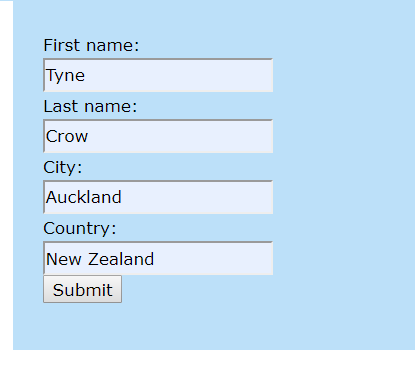
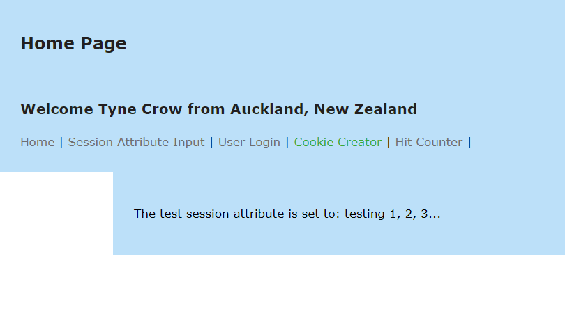
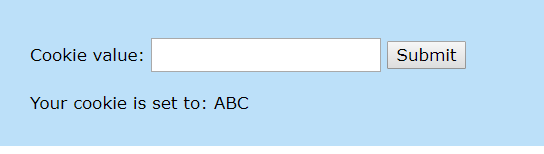
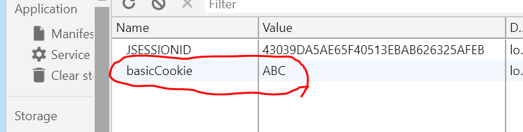

Web Lab 12 &ndash; Cookies and Sessions
==========

Begin by forking this repository into your namespace by clicking the ```fork``` button above, then selecting your username from the resulting window. 
Once completed, click the ```clone``` button, copy the ```Clone with HTTPS``` value. Open IntelliJ, and from the welcome screen 
click ```Check out from Version Control -> Git```, then paste the copied URL into the ```URL``` field of the resulting window. 
Provide your GitLab username and password if prompted.

Explore the files in the project, familiarizing yourself with the content. You will notice that there are no `.html` files in the lab.
They are all `.jsp` files.

When complete, demonstrate your code to your tutor.

Exercise 1 &ndash; Creating and Displaying a Basic Session Attribute
============

In this exercise you will use the `session-attribute.jsp` file containing a basic form and the `SessionAttributeTest` servlet to create a session attribute.
You will then display the session attribute on the `index.jsp` page.

The `session-attribute.jsp` file already has a basic form in it. Add code to the `SessionAttributeTest`servlet to generate a session attribute based on the information input from the form
and then forward the user back to the `index.jsp` page with the RequestDispatcher. 

On the `index.jsp` page, there is a sentence that should display the session attribute - `<p>The test session attribute is set to: ${sessionAttributeTest}</p>`. Check that the 
session attribute displays correctly. You may need to alter the name of the reference to the session attribute to match yours.

Exercise 2  &ndash; Deleting a JSESSIONID
============

This exercise is designed to help you understand how session attributes are linked to individual users.

In the web browser, go to the `Developer tools` by right-clicking and going to `inspect` or going to `options -> More Tools -> Developer Tools`. 

Then go to the `Application` tab and find the JSESSIONID cookie by browsing to `cookies -> localhost:...`.

Delete the cookie and browse back to the main page to check that session attribute is not showing.

The JSESSIONID cookie is what connects a user to a session; however, the session attributes are still stored on the server. 

Exercise 3 &ndash; Creating a User Details JavaBean
=============

In Lab 11, you should have created a simple JavaBean to store user details. Remember a JavaBean is just a normal Java 
class that implements `Serializable` and follows a few other rules. You can use JavaBeans to store information in session
attributes.

In this lab, you will create a similar JavaBean that can be stored within a session attribute so that information about the user
can be accessed from any page on the site.

Tasks:

Create an HTML form in the `user-details.jsp` file that will allow a user to enter their first name, last name, city and country. 

The form should look something like this:



Create a servlet that can handle the form request and generate the appropriate data and session attributes.

Create a JavaBean that can encapsulate the first name, last name, city and country of the user. Remember to revise the requirements
of a JavaBean from yesterday's lecture and lab.

In the servlet:
+ Create a new instance of the JavaBean
+ Use the form data to set the fields of the JavaBean
+ Forward the user back to the home page ( `index.jsp` )

On the homepage, use the session attributes to display a customised message to the user: Welcome First-name Last-name from City, Country.

It should display something like this:



Because this is a session attribute, it has a longer lifetime than a request attribute and the data should remain there as
you browse between different pages and go back to the main page.

Exercise 4 &ndash; Customised Login Message
=============== 

On the home page, use JSTL tags and EL expressions to display the message 'Welcome Please Login' if there is no user details
session attribute present. 

Hint: the attribute should be null if it has not been created.

Exercise 5 &ndash; Basic Cookie Creator
=============== 
Use the `cookie-creator.jsp` file for this exercise; it already has a link to an external JavaScript file `cookie-creator.js` in which
you can create the necessary JavaScript variables and functions.

In this exercise you will create a basic form that allows a user to generate a cookie by entering a value into an input field.

You should use JavaScript to complete this exercise NOT a servlet. 

You should setup your code so that a JavaScript function is called when the form is submitted that will then use the value
the user has entered in an input field to set the content of a cookie. 

Your code should then display the contents of the cookie in the page by getting the cookie contents.

The result should look something like this:



Check the `Developer Tools` to see the cookie. It should look something like this:



There is no one single way to achieve this. You should research cookies and how to create and get them. You will need to use
a prebuilt function to get the cookie; the w3schools reference information has a `getCookie(...)` function that you copy and paste
into your code. 

Exercise 6 &ndash; Advanced Cookie Creator
=============== 
In this exercise you will modify the cookie creator from Exercise 5 so that it keeps adding more values
to the same cookie every time the user submits a new value. It should store these values in a 'stringified' array
so that they can easily be accessed as a JSON object by parsing the contents of the cookie. 

Cookies can only store strings so you will need to research how to convert between strings and JSON objects.

Two methods you should look at using are JSON.stringify(...) and JSON.parse(...).  

Think very carefully about how you will do this and how you can test every step.

This activity may be quite difficult but serializing JSON to strings and parse JSON from strings is very important.

Once you are able to parse the cookie values into an array, iterate through the values and display them on the page in a list.

Extension - Exercise 7 &ndash; Cookie Hit Counter
=============== 

In this exercise you will create a cookie hit counter that will increase the value stored in a cookie every time 
you click on it and a checkbox that will allow you to reset the hit counter. 

You must store the number of hits within a cookie and display this within the span element in the page.

If the check box is checked when the 'Hit Me!' button is clicked, it should reset the cookie to zero.

Use the `hit-counter.jsp` file as a base. You will need to setup JavaScript functions that can handle the logic of adding to 
and resetting the hit counter.


 

